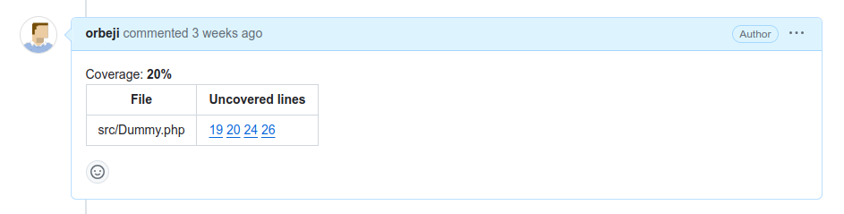

<a name="readme-top"></a>


<!-- PROJECT LOGO -->
<br />
<div align="center">
<h1 align="center">Phpunit PR Coverage Check</h1>
  <p align="center">
    <a href="https://github.com/orbeji/phpunit-pr-coverage-check/issues">Report Bug</a>
    ·
    <a href="https://github.com/orbeji/phpunit-pr-coverage-check/issues">Request Feature</a>
  </p>
</div>


<!-- ABOUT THE PROJECT -->
## About The Project

Inspired by https://github.com/richardregeer/phpunit-coverage-check

This project is a console command that filters the coverage report of your Phpunit tests to only take into account the 
modifications of a PullRequest, so you can be sure that the PR has enough tests.

<p align="right">(<a href="#readme-top">back to top</a>)</p>

<!-- GETTING STARTED -->
## Getting Started

### Installation

Make sure Composer is installed globally, as explained in the
[installation chapter](https://getcomposer.org/doc/00-intro.md)
of the Composer documentation.

Open a command console, enter your project directory and execute:

```console
$ composer require --dev orbeji/phpunit-pr-coverage-check
```

<!-- USAGE EXAMPLES -->
## Usage
There are two ways of using this command:
* Passing a diff file
* Passing git repo information

With the first option you need to generate the appropiate diff file to pass to the command.
The diff file must only contain the modified files/lines of the pr. To do that you can call
`git diff DESTINATION_BRANCH...PR_BRANCH > diff.txt` with 
[Bitbucket](https://support.atlassian.com/bitbucket-cloud/docs/variables-and-secrets/) and 
[GitHub](https://docs.github.com/en/actions/learn-github-actions/variables#default-environment-variables) 
you have environment variables to know 
the current and destination branches.

Diff file example:
Bitbucket
```bash
vendor/bin/phpunit --configuration phpunit.xml.dist --testsuite pipelines --coverage-clover 'clover.xml'
git diff origin/${BITBUCKET_PR_DESTINATION_BRANCH}...origin/${BITBUCKET_BRANCH} > diff.txt
vendor/bin/pr-coverage-check check clover.xml 100 --diff=diff.txt --report=ansi
```
GitHub
```bash
vendor/bin/phpunit --coverage-clover clover.xml
git diff ${GITHUB_BASE_REF}...${GITHUB_REF_NAME} > diff.txt
vendor/bin/pr-coverage-check check clover.xml 100 --diff=diff.txt
```
Git repo information
```bash
vendor/bin/pr-coverage-check check clover.xml 100 --pullrequest-id=1 --provider=Github --workspace=orbeji --repository=test --api_token=API_TOKEN 
```
The API token must have permissions to the PullRequest scope.

For GitHub in the workspace option put the owner of the repo.

In any case if the coverage is not met the command will return the covered percentage
```bash
Coverage 40%
 ```

### Reports
When executing the command line you can pass the option `--report` to generate a table with the uncovered lines of the PR

This option accepts 3 values:
* ansi: Coverage table in console output
* comment: Coverage table in PR comment
* report: Bitbucket report

#### Examples:
ansi:
```
root@bbfb2d246e64:/app# bin/pr-coverage-check check tests/clover.xml 90 --diff=tests/diff.txt --report=ansi
Coverage: 40%
--------------- ------------ 
File            Uncovered Lines
--------------- ------------ 
src/Dummy.php   19, 20, 26
--------------- ------------ 
```
comment:
  
  
report:

### CI Integration
#### Bitbucket Pipelines
```yaml
pipelines:
  pull-requests:
      feature/*:
        - step:
            name: phpunit coverage check
            image:
              name: orbeji/base:7.2-xdebug-cli
            script:
              - composer install
              - vendor/bin/phpunit --configuration phpunit.xml.dist --testsuite pipelines --coverage-clover 'clover.xml'
              - git diff origin/${BITBUCKET_PR_DESTINATION_BRANCH}...origin/${BITBUCKET_BRANCH} > diff.txt
              - vendor/bin/pr-coverage-check check clover.xml 100 --diff=diff.txt --report=ansi
            caches:
              - composer
```
#### GitHub Actions
```yaml
name: PHPUnit and Coverage Check

on: [pull_request]

jobs:
  test:
    runs-on: ubuntu-22.04

    steps:
    - name: Checkout code
      uses: actions/checkout@v4

    - name: Set up PHP
      uses: shivammathur/setup-php@v2
      with:
        php-version: '7.2'

    - name: Install dependencies
      run: composer install

    - name: Run PHPUnit with coverage
      run: vendor/bin/phpunit --configuration phpunit.xml.dist --testsuite pipelines --coverage-clover 'clover.xml'

    - name: Git diff
      run: git fetch && git diff origin/${GITHUB_BASE_REF}...origin/${GITHUB_HEAD_REF} > diff.txt

    - name: PR Coverage Check
      run: vendor/bin/pr-coverage-check check clover.xml 100 --diff=diff.txt --report=ansi

```

<!-- ROADMAP -->
## Roadmap

- [ ] Add Bitbucket report example screenshot
- [x] Add examples of CI for Bitbucket and GitHub 


See the [open issues](https://github.com/orbeji/phpunit-pr-coverage-check/issues) for a full list of proposed features (and known issues).

<p align="right">(<a href="#readme-top">back to top</a>)</p>


<!-- CONTRIBUTING -->
## Contributing

Pull requests are welcome. For major changes, please open an issue first
to discuss what you would like to change.

Please make sure to update tests as appropriate and that all the GitHub Actions are passing.

<p align="right">(<a href="#readme-top">back to top</a>)</p>


<!-- LICENSE -->
## License

Distributed under the [MIT](https://choosealicense.com/licenses/mit/) License. 

<p align="right">(<a href="#readme-top">back to top</a>)</p>


<!-- CONTACT -->
## Contact

Project Link: [https://github.com/orbeji/phpunit-pr-coverage-check](https://github.com/orbeji/phpunit-pr-coverage-check)

<p align="right">(<a href="#readme-top">back to top</a>)</p>
